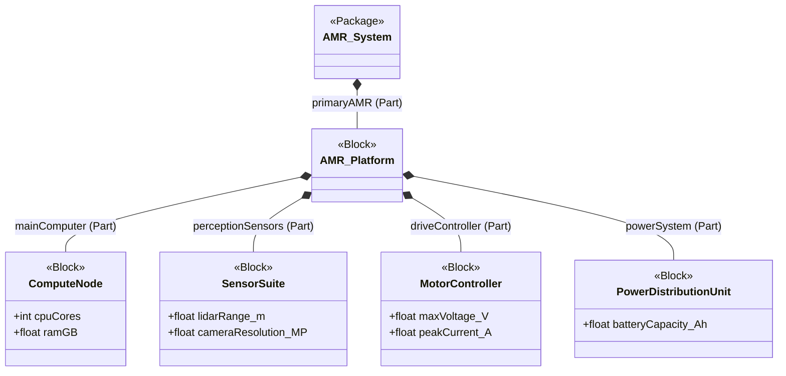

# SysML v2 Models

This directory contains foundational SysML v2 models demonstrating core Model-Based Systems Engineering (MBSE) principles. The target system modeled is an Autonomous Mobile Robot (AMR).

## System Decomposition

The following Mermaid diagram illustrates the intended structural decomposition of the AMR system described by the accompanying `.sysml` files. Formal parsing and semantic validation are outside this repository's current verification scope.

## Included Models

*   **`bdd_amr_architecture.sysml`**: A Block Definition Diagram (BDD) equivalent defining the basic blocks, their attributes (value properties), and interface ports.
*   **`ibd_amr_interconnects.sysml`**: An Internal Block Diagram (IBD) equivalent that instantiates the blocks as parts and connects them via their ports, demonstrating data and power flows.
*   **`pkg_amr_decomposition.sysml`**: A top-level structural decomposition showing the `Package -> Block -> Part -> Port` hierarchy utilizing redefinitions.
*   **`uaf_reference_outline.md`**: A draft outline mapping this system to the Unified Architecture Framework (UAF).

## Modeling intent

These examples are intended to illustrate a transition from a block-definition-style view to internal interconnects and a package decomposition. They are study material, not proof of SysML v2 conformance, a validated system architecture, or an integrated robot design.
